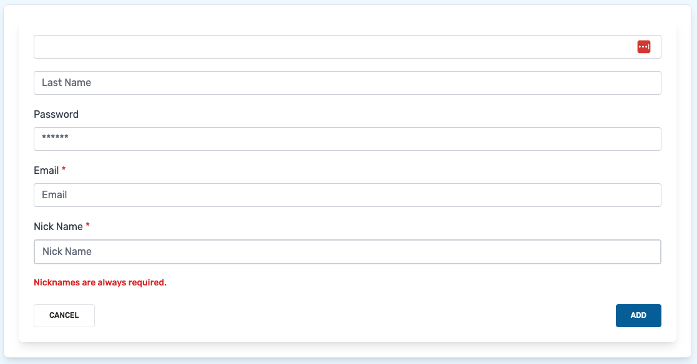

# Vue3 Forms

---

Set of simple form components for Vue 3

## Installation

```shell
npm install @mythicaldev/md-vue3-forms
```

#### OR

```shell
npm i @mythicaldev/md-vue3-forms
```

## Tailwind configuration

You will need to update your tailwind.config.js file to include the following in your `content` array.

```javascript
./node_modules/@mythicaldev/md-vue3-forms/**/*.vue
```

## Components

Below is the list of components, their properties and examples of how to use them.

- [MDForm](#mdform)
- [MDGroup](#mdgroup)
- [MDText](#mdtext)
- [MDCheckbox](#mdcheckbox)
- [MDDatePicker](#mddatepicker)
- [MDDraggablePicker](#mddraggablepicker)
- [MDDropZone](#mddropzone)
- [MDSelect](#mdselect)
- [MDTextArea](#mdtextarea)

### MDForm

**(Required)**

Every form is wrapped in this base MFForm component. This component provides a submit button, optional cancel button 
and assignable actions for those buttons. You next the form elements you need for your form within this base element.

```vue
<template>
  <MDForm class="my-5">Form at it's most basic level, only a submit button</MDForm>
  <MDForm class="mb-5" :showCancel="true">Form that includes a cancel button</MDForm>
  <MDForm class="mb-5" :showCancel="true" submitText="Add" cancelText="Back">
    Form that includes a cancel button and custom text for each button
  </MDForm>
  <MDForm
    class="mb-20"
    :showCancel="true"
    submitText="Add"
    cancelText="Back"
    @onSubmitClicked="submit"
    @onCancelClicked="cancel">
    Form that includes a cancel button, custom text and methods assigned to those buttons
  </MDForm>
</template>
<script setup>
  // Import the main form component
  import { MDForm } from '@mythicaldev/md-vue3-forms';

  const submit = () => {};
  const cancel = () => {};
</script>
```


#### MDForm Props

| Prop         | Type     | Default | Required | Description                    |
|--------------|----------|---------|----------|--------------------------------|
| showCancel   | Boolean  | false   | false    | Display/Hide the cancel button |
| showSubmit   | Boolean  | true    | false    | Display/Hide the submit button |
| cancelText   | String   | Cancel  | false    | Text for the cancel button     |
| submitText   | String   | Submit  | false    | Text for the cancel button     |

#### MDForm Emitted Events

| Event           | Description                               |
|-----------------|-------------------------------------------|
| onCancelClicked | Emitted when the cancel button is clicked |
| onSubmitClicked | Emitted when the submit button is clicked |

### MDGroup

Wrapper element to group related form fields in.

```vue

<template>
  <MDForm>
    <MDGroup>Add your form fields here.</MDGroup>
  </MDForm>
</template>
<script setup>
  // Import the base form component and the optional group component.
  import { MDForm, MDGroup } from '@mythicaldev/md-vue3-forms';
</script>
```


### MDText

This is a basic text input field.

```vue
<template>
  <MDForm :showCancel="true" submitText="Add" @onSubmitClicked="submit">
    <MDGroup>
      <!-- Bare bones basic text field -->
      <MDText class="mb-5" id="first_name" v-model="state.name.first" />
      <!-- Text field with a placeholder -->
      <MDText class="mb-5" id="last_name" placeholder="Last Name" v-model="state.name.last" />
      <!-- Secure field with a label and placeholder -->
      <MDText
        class="mb-5"
        type="password"
        id="password"
        label="Password"
        placeholder="******"
        v-model="state.password"
      />
      <!-- Required field with a label (Label is used as a placeholder by default) -->
      <MDText class="mb-5" type="email" id="email" label="Email" v-model="state.email" :required="true" />
      <!-- Required, Label, and error state. -->
      <MDText
        class="mb-5"
        id="nickname"
        label="Nick Name"
        v-model="state.nickname"
        :required="true"
        :error="state.errors.nickname"
      />
    </MDGroup>
  </MDForm>
</template>
<script setup>
  import { reactive } from 'vue';
  // Import the main form component, a group to wrap a set of fields in and the text field.
  import { MDForm, MDGroup, MDText } from '@mythicaldev/md-vue3-forms';

  const state = reactive({
    name: {
      first: '',
      last: '',
    },
    email: '',
    nickname: '',
    password: '',
    errors: {
      nickname: 'Nicknames are always required.',
    },
  });

  const submit = () => {
    console.log(state);
  };
</script>
```


#### MDText Props

| Prop        | Type             | Default | Required | Description                                                                      |
|-------------|------------------|---------|----------|----------------------------------------------------------------------------------|
| id          | String           |         | true     | The id of the field.                                                             |
| label       | String           |         | false    | The label to add to the field. Empty by default providing no label.              |
| type        | String           | text    | false    | The type of field to use. Defaults to a basic text field.                        |
| modelValue  | [String, Number] |         | false    | The property to update. This should be passed as `v-model` when implementing     |
| placeholder | String           |         | false    | The placeholder to use for the field. Empty by default providing no placeholder. |
| describedBy | String           |         | false    | The `aria-describedby` value for the field.                                      |
| help        | String           |         | false    | Text that will display under the field to give help or context.                  |
| error       | String           |         | false    | Error text to display under the field.                                           |
| enabled     | Boolean          | true    | false    | Determines if the field is enabled or not.                                       |
| success     | Boolean          | false   | false    | Style the field indicating success.                                              |
| info        | Boolean          | false   | false    | Style the field for information feedback                                         |
| warning     | Boolean          | false   | false    | Style the field as warning, for example when there is an error displayed.        |
| required    | Boolean          | false   | false    | Determines if the field is required or not.                                      |

### MDCheckbox

Simple checkbox. Can default to checked or not and emits a single event. 
```vue
<template>
  <MDForm class="my-10">
    <MDGroup>
      <!-- Bare bones, checkbox only -->
      <MDCheckbox :isChecked="false" @selected="selected" />
      <!-- Include a label if desired -->
      <MDLabel id="check1" label="Unchecked" />
      <MDCheckbox :isChecked="false" @selected="selected" />
      <!-- Default to being checked -->
      <MDLabel id="check2" label="Checked" />
      <MDCheckbox :isChecked="true" @selected="selected" />
    </MDGroup>
  </MDForm>
</template>
<script setup>
  // Import the form, group, label and checkbox components.
  import { MDForm, MDGroup, MDCheckbox, MDLabel } from '@mythicaldev/md-vue3-forms';
  
  const selected = () => {};
</script>
```


#### MDCheckbox Props

| Prop      | Type    | Default | Required | Description                                   |
|-----------|---------|---------|----------|-----------------------------------------------|
| isChecked | Boolean | false   | false    | Determines if the checkbox is checked or not. |

#### MDCheckbox Emitted Events

| Event    | Description                                       |
|----------|---------------------------------------------------|
| selected | Emitted when the checkbox is checked or unchecked |

### MDDatePicker

Integrates the `@vuepic/vue-datepicker` package for a flexible datepicker field.

[@vuepic/vue-datepicker](https://www.npmjs.com/package/@vuepic/vue-datepicker)

```vue
<template>
  <MDForm class="my-10">
    <MDGroup>
      <!-- Basic, bare bones -->
      <MDDatePicker id="date" v-model="state.start" />
      <!-- With the time picker enabled -->
      <MDDatePicker id="date" v-model="state.end" :enableTimePicker="true" />
    </MDGroup>
  </MDForm>
</template>
<script setup>
  import { reactive } from 'vue';
  // Import the form, group, label and checkbox components.
  import { MDForm, MDGroup, MDDatePicker } from '@mythicaldev/md-vue3-forms';

  const state = reactive({
    start: new Date(),
    end: new Date(),
  });
</script>
```
#### Basic, Bare bones


#### With time picker enabled


#### MDDatePicker Props

| Prop             | Type    | Default    | Required | Description                                                                   |
|------------------|---------|------------|----------|-------------------------------------------------------------------------------|
| id               | String  |            | true     | The id of the form field.                                                     |
| modelValue       | Date    | new Date() | true     | The property to update. This should be passed as `v-model` when implementing. |
| enableTimePicker | Boolean | false      | false    | Determines if the time picker is enabled.                                     |
| format           | String  | MM/dd/yyyy | false    | The format to apply to the date-time.                                         |
| label            | String  |            | false    | The label to add to the field. Empty by default providing no label.           |
| describedBy      | String  |            | false    | The `aria-describedby` value for the field.                                   |
| help             | String  |            | false    | Text that will display under the field to give help or context.               |
| error            | String  |            | false    | Error text to display under the field.                                        |
| success          | Boolean | false      | false    | Style the field indicating success.                                           |
| info             | Boolean | false      | false    | Style the field for information feedback                                      |
| warning          | Boolean | false      | false    | Style the field as warning, for example when there is an error displayed.     |
| required         | Boolean | false      | false    | Determines if the field is required or not.                                   |

### MDDraggablePicker

Integrates the vue.draggable package allowing you to drag an item from one list to another.

[vue.draggable@next](https://github.com/SortableJS/vue.draggable.next)

```vue
<template>
  <MDForm class="my-10">
    <MDGroup>
      <MDDraggablePicker 
        id="test"
        v-model="state.books"
        selectedLabel="Selected Items"
        availableLabel="Available Items"
      />
    </MDGroup>
  </MDForm>
</template>
<script setup>
  import { reactive } from 'vue';
  // Import the form, group and draggable components.
  import { MDForm, MDGroup, MDDraggablePicker } from '@mythicaldev/md-vue3-forms';
  
  const state = reactive({
    books: {
      available: [
        {
          id: 1,
          name: 'The Shining',
        },
        {
          id: 1,
          name: 'Pride and Prejudice',
        },
        {
          id: 1,
          name: '1984',
        },
        {
          id: 1,
          name: 'The Lord of the Rings',
        },
        {
          id: 1,
          name: 'The Old Man and the Sea',
        },
      ],
      selected: [],
    },
  });
</script>
```


#### MDDraggablePicker Props

| Prop           | Type    | Default                         | Required | Description                                                                  |
|----------------|---------|---------------------------------|----------|------------------------------------------------------------------------------|
| id             | Boolean |                                 | true     | The id of the element.                                                       |
| availableLabel | String  |                                 | true     | Label for the available column                                               |
| selectedLabel  | String  |                                 | true     | Label for the selected column                                                |
| modelValue     | Object  | { available: [], selected: [] } | true     | The property to update. This should be passed as `v-model` when implementing |
| label          | String  |                                 | false    | Used to add a label.                                                         |
| error          | String  |                                 | false    | Used to display an error to the lists.                                       |
| required       | Boolean | false                           | false    | Determines if the lists should be marked as required or not.                 |

#### MDDraggablePicker Emitted Events

| Event           | Description                                               |
|-----------------|-----------------------------------------------------------|
| onDragComplete  | Emitted when an item is dragged from one list to another. |
| onAllAssigned   | Emitted when the **Assign All** button is clicked.        |
| onAllRemoved    | Emitted when the **Remove All** button is clicked.        |

### MDDropZone

Simple dropzone for image uploads. Utilizes the `vue3-dropzone` and `sweetalert2` libraries.

```vue
<template>
  <MDForm>
    <MDGroup>
      <MDDropZone id="images" v-model="state.images" @onDrop="imageAddedToDropzone" />
    </MDGroup>
  </MDForm>
</template>
<script setup>
  import { reactive } from 'vue';
  // Import the components
  import { MDForm, MDGroup, MDDropZone } from '@mythicaldev/md-vue3-forms';

  const state = reactive({
    images: [],
  });
  const imageAddedToDropzone = () => {};
</script>
```
#### Empty Dropzone 


#### One Image Added


#### Deleting Image


#### MDDropZone Props

| Prop               | Type     | Default                                                 | Required | Description                                                                   |
|--------------------|----------|---------------------------------------------------------|----------|-------------------------------------------------------------------------------|
| id                 | Boolean  |                                                         | true     | The id of the element.                                                        |
| modelValue         | Array    | []                                                      | true     | The property to update. This should be passed as `v-model` when implementing. |
| label              | String   |                                                         | false    | Used to add a label.                                                          |
| required           | Boolean  | false                                                   | false    | Determines if the lists should be marked as required or not.                  |
| showPreview        | Boolean  | true                                                    | false    | Show the uploaded images below the dropzone.                                  |
| helpText           | String   | Drag and drop some files here, or click to select files | false    | Text to show in the dropzone.                                                 | 
| hoverText          | String   | Drop the files here ...                                 | false    | Text to display when image is hovered over the dropzone.                      | 
| showConfirmation   | Boolean  | true                                                    | false    | Determines if a confirmation is shown when removing an image.                 |
| confirmationConfig | Object   | see configuration object below                          | false    | Configuration to use in the Sweet Alert when deleting an image.               |

```javascript
{
    title: '',
    text: 'Are you sure?',
    icon: 'warning',
    showCancel: true,
    button: {
    color: '#3085d6',
    text: 'OK',
}
```

#### MDDropZone Emitted Events

| Event   | Description                                        |
|---------|----------------------------------------------------|
| onDrop  | Emitted when an an image is added to the dropzone. |

### MDSelect

Single select utilizing `@headlessui/vue`. YOu are able to filter the options by typing into the field or 
selected them using the dropdown directly.

```vue
<template>
  <MDForm>
    <MDGroup>
      <MDSelect label="Book Titles" id="book_titles" :options="selectOptions" v-model="state.selectedBook" />
    </MDGroup>
  </MDForm>
</template>
<script setup>
  import { reactive } from 'vue';
  // Import the components
  import { MDForm, MDGroup, MDSelect } from '@mythicaldev/md-vue3-forms';

  const selectOptions = [
    {
      value: '1',
      label: 'The Shining',
    },
    {
      value: '2',
      label: 'Pride and Prejudice',
    },
    {
      value: '3',
      label: '1984',
    },
    ...
  ];
  
  const state = reactive({
    selectedBook: '',
  });
</script>
```


#### MDSelect Props

| Prop        | Type             | Default | Required | Description                                                                      |
|-------------|------------------|---------|----------|----------------------------------------------------------------------------------|
| id          | String           |         | true     | The id of the field.                                                             |
| options     | Array            | []      | true     | Values to display in the list. See the object below for formatting.              |
| label       | String           |         | false    | The label to add to the field. Empty by default providing no label.              |
| type        | String           | text    | false    | The type of field to use. Defaults to a basic text field.                        |
| modelValue  | [String, Number] |         | false    | The property to update. This should be passed as `v-model` when implementing     |
| placeholder | String           |         | false    | The placeholder to use for the field. Empty by default providing no placeholder. |
| describedBy | String           |         | false    | The `aria-describedby` value for the field.                                      |
| help        | String           |         | false    | Text that will display under the field to give help or context.                  |
| error       | String           |         | false    | Error text to display under the field.                                           |
| success     | Boolean          | false   | false    | Style the field indicating success.                                              |
| info        | Boolean          | false   | false    | Style the field for information feedback                                         |
| warning     | Boolean          | false   | false    | Style the field as warning, for example when there is an error displayed.        |
| required    | Boolean          | false   | false    | Determines if the field is required or not.                                      |

#### Format for options property.

```javascript
[
  {
    label: '',
    value: '',
  },
];
```

### MDTextArea

Text area with limit if needed.

```vue
<template>
  <MDForm class="my-10">
    <MDGroup>
      <MDTextArea label="Description 1" id="description1" v-model="state.description1" />
      <MDTextArea label="Description 2" id="description2" rows="5" v-model="state.description2" />
      <MDTextArea label="Description 3" id="description3" rows="8" v-model="state.description3" :hasLimit="true" />
      <MDTextArea label="Description 4" id="description4" rows="8" v-model="state.description4" :hasLimit="true" />
    </MDGroup>
  </MDForm>
</template>
<script setup>
  import { reactive } from 'vue';
  // Import the components
  import { MDForm, MDGroup, MDTextArea } from '@mythicaldev/md-vue3-forms';
  
  const state = reactive({
    description1: '',
    description2: '',
    description3: '',
    description4: '',
  });
</script>
```


#### MDTextArea Props

| Prop        | Type             | Default | Required | Description                                                                      |
|-------------|------------------|---------|----------|----------------------------------------------------------------------------------|
| id          | String           |         | true     | The id of the field.                                                             |
| label       | String           |         | false    | The label to add to the field. Empty by default providing no label.              |
| type        | String           | text    | false    | The type of field to use. Defaults to a basic text field.                        |
| modelValue  | [String, Number] |         | false    | The property to update. This should be passed as `v-model` when implementing     |
| rows        | String           | 4       | false    | The number of rows for the textarea                                              |
| hasLimit    | Boolean          | false   | false    | Determines if the field should have a limit or not.                              |
| limit       | Number           | 255     | false    | The limit to impose on the textarea.                                             |
| placeholder | String           |         | false    | The placeholder to use for the field. Empty by default providing no placeholder. |
| describedBy | String           |         | false    | The `aria-describedby` value for the field.                                      |
| help        | String           |         | false    | Text that will display under the field to give help or context.                  |
| error       | String           |         | false    | Error text to display under the field.                                           |
| success     | Boolean          | false   | false    | Style the field indicating success.                                              |
| info        | Boolean          | false   | false    | Style the field for information feedback                                         |
| warning     | Boolean          | false   | false    | Style the field as warning, for example when there is an error displayed.        |
| required    | Boolean          | false   | false    | Determines if the field is required or not.                                      |

## License

[MIT](https://opensource.org/licenses/MIT)